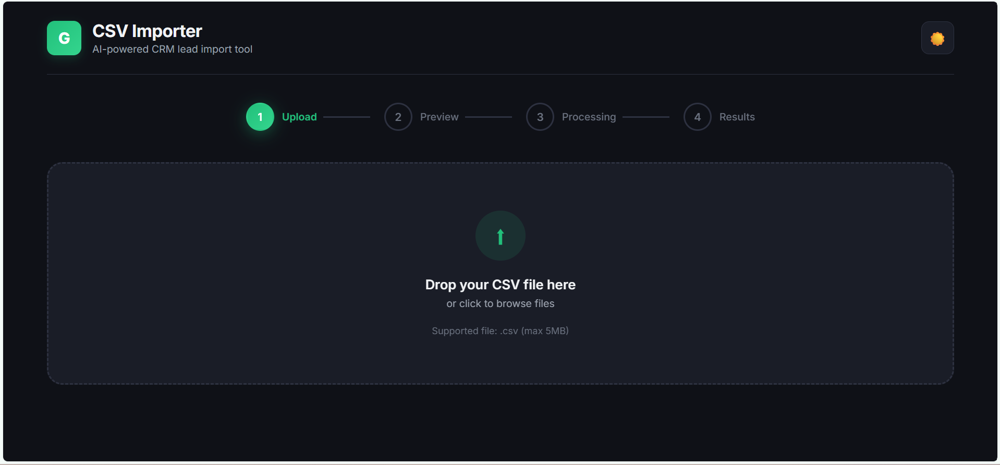
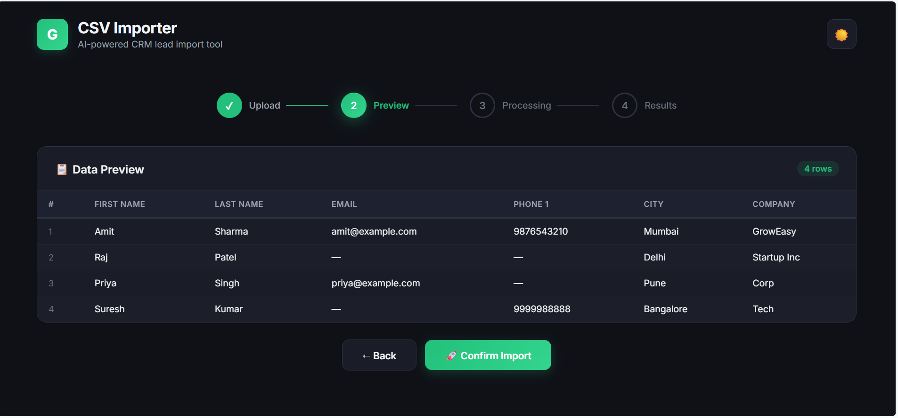
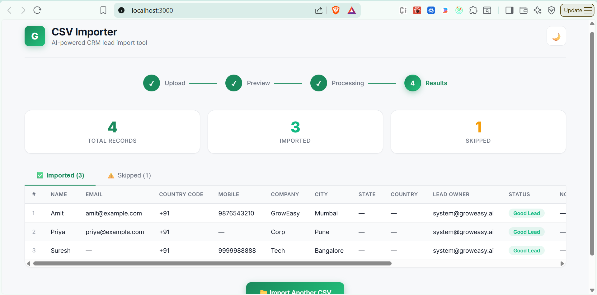

# GrowEasy AI-Powered CSV Importer

An intelligent CSV importer that uses AI (Google Gemini) to automatically map any CSV format to GrowEasy CRM fields. Upload CSV exports from Facebook Leads, Google Ads, Excel sheets, real estate CRMs, or any custom format — the AI handles the field mapping.


## Application Screenshots

### 1. Step 1 — Drag & Drop CSV Upload (Dark Mode Theme)


### 2. Step 2 — Client-Side CSV Preview with Sticky Headers (Dark Mode Theme)


### 3. Step 4 — Parsed Results Dashboard with Stats and Skipped Records (Light Mode Theme)


## Features

- **Drag & Drop Upload** — Drop any CSV file or click to browse
- **Instant Preview** — Client-side CSV parsing with responsive table (sticky headers, scrolling)
- **AI-Powered Mapping** — Gemini 2.0 Flash intelligently maps arbitrary columns to CRM fields
- **Batch Processing** — Records processed in batches of 10 with retry logic (up to 3 retries)
- **Smart Extraction** — Handles multiple emails/phones, maps statuses, validates data
- **Results Dashboard** — Stats cards + tabbed view for imported and skipped records
- **Dark Mode** — Toggle between light and dark themes
- **Responsive Design** — Works on desktop, tablet, and mobile
- **Error Handling** — Graceful error messages for invalid files, API failures, etc.

## Tech Stack

| Layer | Technology |
|-------|-----------|
| Frontend | Next.js 14 (App Router), React 18, PapaParse |
| Backend | Node.js, Express.js |
| AI | Google Gemini 2.0 Flash |
| CSV Parsing | csv-parse (server), PapaParse (client) |
| File Upload | Multer (memory storage) |
| Styling | Vanilla CSS (custom design system) |

## Project Structure

```
groweasy-task/
├── frontend/                  # Next.js frontend
│   ├── src/
│   │   ├── app/
│   │   │   ├── globals.css    # Design system (light/dark mode)
│   │   │   ├── layout.js      # Root layout with SEO meta
│   │   │   └── page.js        # Main page (4-step state machine)
│   │   ├── components/
│   │   │   ├── FileUpload.jsx  # Drag & drop upload
│   │   │   ├── CsvPreview.jsx  # Data preview table
│   │   │   ├── ResultsTable.jsx # AI results with tabs
│   │   │   ├── Stepper.jsx     # Step indicator
│   │   │   └── StatsCards.jsx  # Import statistics
│   │   └── lib/
│   │       └── api.js          # Backend API helper
│   ├── next.config.js          # API proxy to backend
│   └── package.json
│
├── backend/                   # Express backend
│   ├── src/
│   │   ├── index.js           # Server entry point
│   │   ├── routes/
│   │   │   └── import.js      # POST /api/import
│   │   ├── services/
│   │   │   ├── csvParser.js   # CSV parsing (csv-parse)
│   │   │   └── aiExtractor.js # Gemini AI batch extraction
│   │   ├── utils/
│   │   │   └── prompt.js      # AI prompt template
│   │   └── middleware/
│   │       └── upload.js      # Multer config
│   ├── .env.example
│   └── package.json
│
├── .gitignore
└── README.md
```

## Setup Instructions

### Prerequisites

- Node.js 18+ installed
- Google Gemini API key ([get one here](https://aistudio.google.com/apikey))

### 1. Clone the Repository

```bash
git clone https://github.com/YOUR_USERNAME/groweasy-task.git
cd groweasy-task
```

### 2. Backend Setup

```bash
cd backend
npm install

# Create .env file from template
cp .env.example .env

# Edit .env and add your Gemini API key
# GEMINI_API_KEY=your_key_here

# Start the backend server
npm run dev
```

The backend will start on `http://localhost:5000`.

### 3. Frontend Setup

```bash
cd frontend
npm install

# Start the frontend dev server
npm run dev
```

The frontend will start on `http://localhost:3000`.

### 4. Open the App

Navigate to `http://localhost:3000` in your browser.

## How It Works

### User Flow

1. **Upload** — Drag & drop or select a CSV file (any format, max 5MB)
2. **Preview** — Instantly see your data in a beautiful table (parsed client-side)
3. **Confirm** — Click "Confirm Import" to send data to the AI
4. **Results** — View extracted CRM records with stats (imported/skipped counts)

### AI Processing Pipeline

1. CSV file is uploaded to the Express backend
2. `csv-parse` converts the raw CSV into record objects
3. Records are split into batches of 10
4. Each batch is sent to Gemini 2.0 Flash with a detailed prompt
5. Gemini maps arbitrary column names to GrowEasy CRM fields
6. Results are aggregated and returned as structured JSON

### CRM Fields Extracted

| Field | Description |
|-------|------------|
| `created_at` | Lead creation date |
| `name` | Lead name |
| `email` | Primary email |
| `country_code` | Country dialing code |
| `mobile_without_country_code` | Mobile number |
| `company` | Company name |
| `city` | City |
| `state` | State |
| `country` | Country |
| `lead_owner` | Lead owner |
| `crm_status` | Status (GOOD_LEAD_FOLLOW_UP, DID_NOT_CONNECT, BAD_LEAD, SALE_DONE) |
| `crm_note` | Notes, extra contacts, remarks |
| `data_source` | Source (leads_on_demand, meridian_tower, etc.) |
| `possession_time` | Property possession time |
| `description` | Additional description |

### AI Rules

- **Status values**: Only `GOOD_LEAD_FOLLOW_UP`, `DID_NOT_CONNECT`, `BAD_LEAD`, `SALE_DONE`
- **Data sources**: Only specific values or left blank
- **Multiple emails/phones**: First is used, rest go to `crm_note`
- **Invalid records**: Skipped if no email AND no mobile number
- **Retry logic**: Failed batches retry up to 3 times

## API Reference

### `POST /api/import`

Upload a CSV file for AI processing.

**Request:** `multipart/form-data` with field `file` (CSV)

**Response:**
```json
{
  "success": true,
  "data": {
    "records": [...],
    "skipped": [...],
    "totalImported": 10,
    "totalSkipped": 2
  }
}
```

### `GET /api/health`

Health check endpoint.

**Response:**
```json
{
  "status": "ok",
  "message": "GrowEasy CSV Importer API is running"
}
